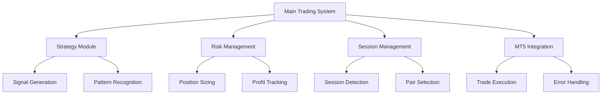

# Advanced Forex Trading Bot

[](https://www.python.org/downloads/)
[](https://www.metatrader5.com/)
[](TESTING.md)
[]()

A sophisticated forex trading bot featuring adaptive moving average strategy, dynamic risk management, session-based trading, and comprehensive backtesting capabilities.

## Core Features

### Advanced Trading Strategy
- **Adaptive Moving Average (AMA) System**
  - AMA50/AMA200 crossover strategy with dynamic gap validation
  - Multiple timeframe analysis with weighted signals
  - Volume-Weighted Moving Average (VWMA) confirmation
  - Price action pattern recognition

### Comprehensive Risk Management
- **Dynamic Position Sizing**
  - Account balance-based calculations
  - Market volatility adjustments
  - Session-specific risk scaling
  - Leverage compliance monitoring

- **Profit Management**
  - Daily profit targets and drawdown limits
  - Evaluation period tracking
  - Account balance monitoring
  - Dynamic risk adjustment based on performance

### Market Analysis
- **Technical Indicators**
  - ADX for trend strength validation
  - MACD momentum confirmation
  - RSI overbought/oversold filter
  - Bollinger Bands volatility analysis

- **Pattern Recognition**
  - Dynamic support/resistance levels
  - Harmonic pattern detection
  - Candlestick pattern analysis
  - Breakout validation with volume confirmation

### Session Management
- **Intelligent Scheduling**
  - Automatic session detection
  - Pair selection based on active sessions
  - Risk adjustment during session overlaps
  - High-impact news avoidance

## System Architecture



## Installation

### Prerequisites
- Python 3.8 or higher
- MetaTrader 5 platform
- Active MT5 trading account

### Quick Setup
```bash
# Clone repository
git clone https://github.com/yourusername/forex-trading-bot.git
cd forex-trading-bot

# Install dependencies
pip install -r requirements.txt

# Configure settings
cp config.example.py config.py
# Edit config.py with your settings

# Run tests
python run_tests.py
```

### Cloud Deployment
For deploying to cloud servers (Azure, AWS, etc.):
```bash
# Package the bot
./package_bot.sh

# Deploy using provided scripts
See deployment_guide.txt for detailed instructions
```

## Configuration

### Trading Parameters
```python
# config.py example
SYMBOLS = ["EURUSD", "GBPUSD", "USDJPY"]
TIMEFRAME = "M5"
DEFAULT_RISK_PERCENT = 1.0
DAILY_PROFIT_TARGET = 500
DAILY_MAX_LOSS = -200
```

### Risk Management Settings
- Set position size limits
- Configure drawdown thresholds
- Adjust risk per trade
- Set daily profit/loss limits

### Session Parameters
- Define trading sessions
- Set session-specific risk levels
- Configure pair selection criteria
- Adjust for session overlaps

## Trading Strategy Details

### Signal Generation
1. **Primary Signal**
   - AMA50/AMA200 crossover analysis
   - Dynamic gap percentage validation
   - Price action confirmation
   - Volume trend analysis

2. **Supporting Filters**
   - ADX trend strength validation
   - MACD momentum confirmation
   - RSI overbought/oversold checks
   - Volatility analysis using Bollinger Bands

### Risk Controls
1. **Pre-Trade**
   - Market condition checks
   - Spread monitoring
   - News event avoidance
   - Session validation

2. **During Trade**
   - Dynamic stop-loss adjustment
   - Trailing stop management
   - Position size scaling
   - Drawdown monitoring

## Backtesting

### Features
- Historical data analysis
- Multiple timeframe testing
- Parameter optimization
- Performance analytics

### Usage
```bash
python run_backtest.py
```

See [Backtesting Guide](backtesting_guide.md) for detailed instructions.

## Documentation

### Guides
- [Testing Guide](TESTING.md)
- [ADX Filter Guide](adx_filter_guide.md)
- [Exit Strategy Guide](exit_strategy_guide.md)
- [Backtesting Guide](backtesting_guide.md)
- [Deployment Guide](deployment_guide.txt)

### API Documentation
- [MT5 Helper Documentation](mt5_helper.md)
- [Strategy Documentation](strategy.md)
- [Risk Management Documentation](risk_manager.md)

## Monitoring

### Logging
- Comprehensive trade logging
- Error tracking
- Performance metrics
- System diagnostics

### Discord Integration
- Real-time trade notifications
- Error alerts
- Daily performance summaries
- System status updates

## Performance Metrics

### Risk Management
- Dynamic position sizing based on:
  - Account balance
  - Market volatility
  - Session characteristics
  - Current drawdown

### Profit Tracking
- Daily profit/loss monitoring
- Drawdown calculations
- Running performance metrics
- Evaluation period tracking

## Future Enhancements

### Planned Features
- Machine learning integration
- Portfolio-level analysis
- Advanced risk modeling
- Web-based dashboard

### Under Development
- Neural network pattern recognition
- Automated parameter optimization
- Enhanced market analysis tools
- Extended backtesting capabilities

## Contributing

1. Fork the repository
2. Create your feature branch
3. Commit your changes
4. Push to the branch
5. Create a pull request

## License

This project is licensed under the MIT License - see the LICENSE file for details.

## Disclaimer

This software is for educational purposes only. Use at your own risk. Past performance does not guarantee future results.
